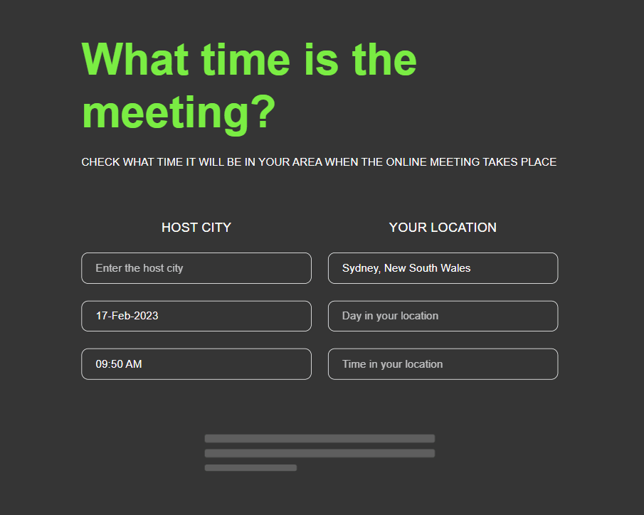

# A Timechecker app helps to organise online meetings for participants from different time zones. Check what time and day it will be in two different cities at one point of time

## Link
[Project on Github pages](https://tatianamoseeva.github.io/timechecker/)

## Features 
:star: Developed with Create React App  
:star: A Timezone API implemented  
:star: Address input with Autocomplete  
:star: Copy output to the clipboard  
:star: Optimised with React component libraries  
:star: Error handling and loading mode  
:star: Responsive web design adapted to all screen sizes  
 

## Execution

:white_check_mark: Layout design in Figma  
:white_check_mark: HTML layout development and styling with SCSS  
:white_check_mark: Developed functionality using React JS, rest APIs and components  
:white_check_mark: Testing and validation  